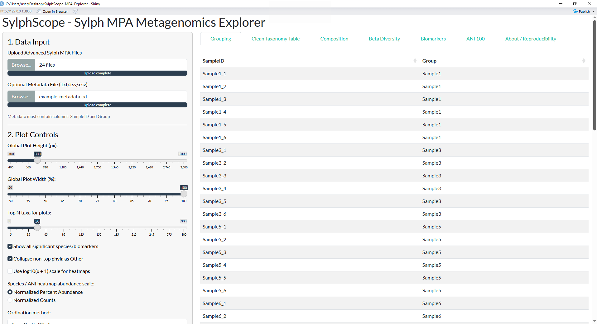
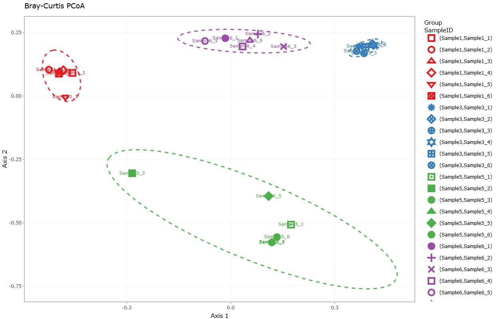
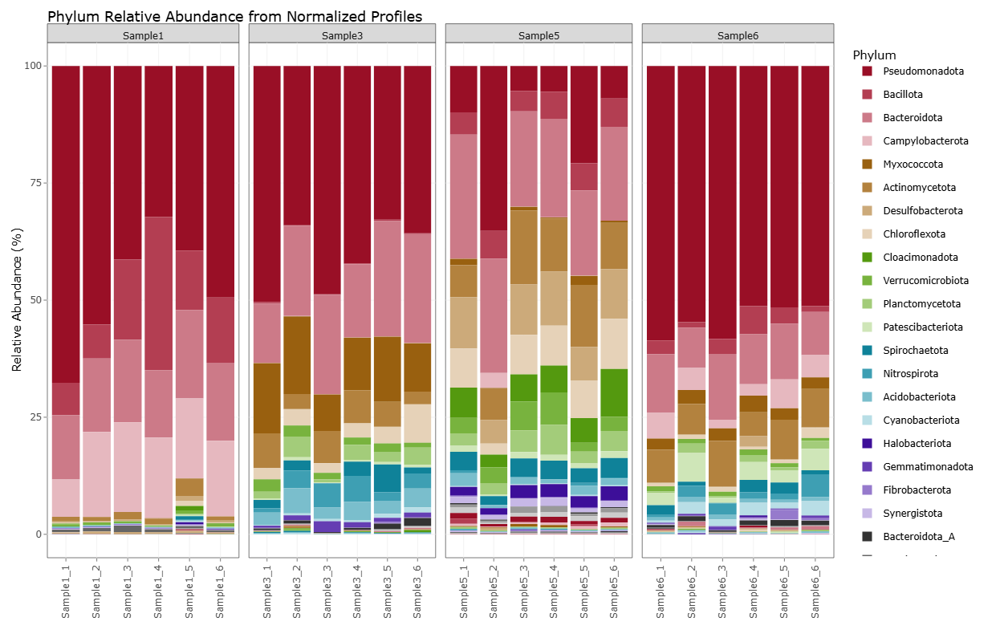
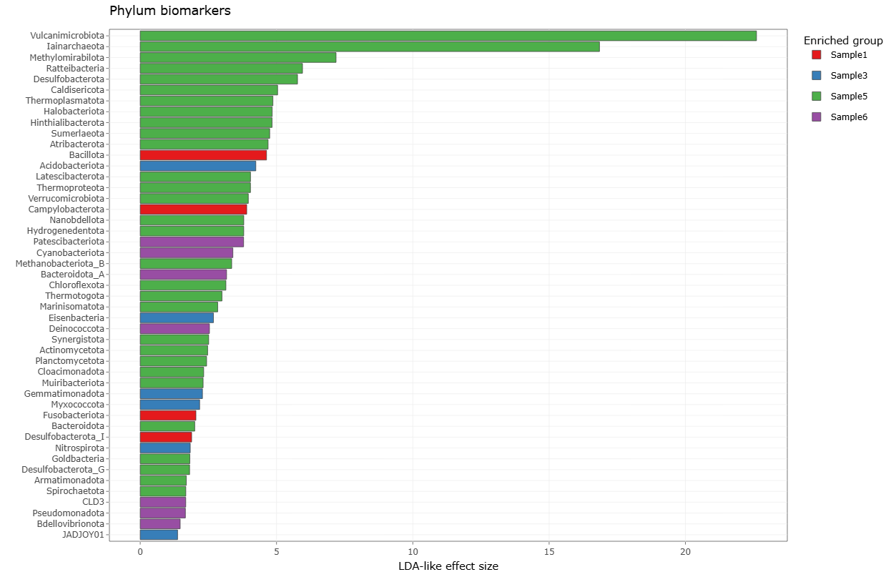
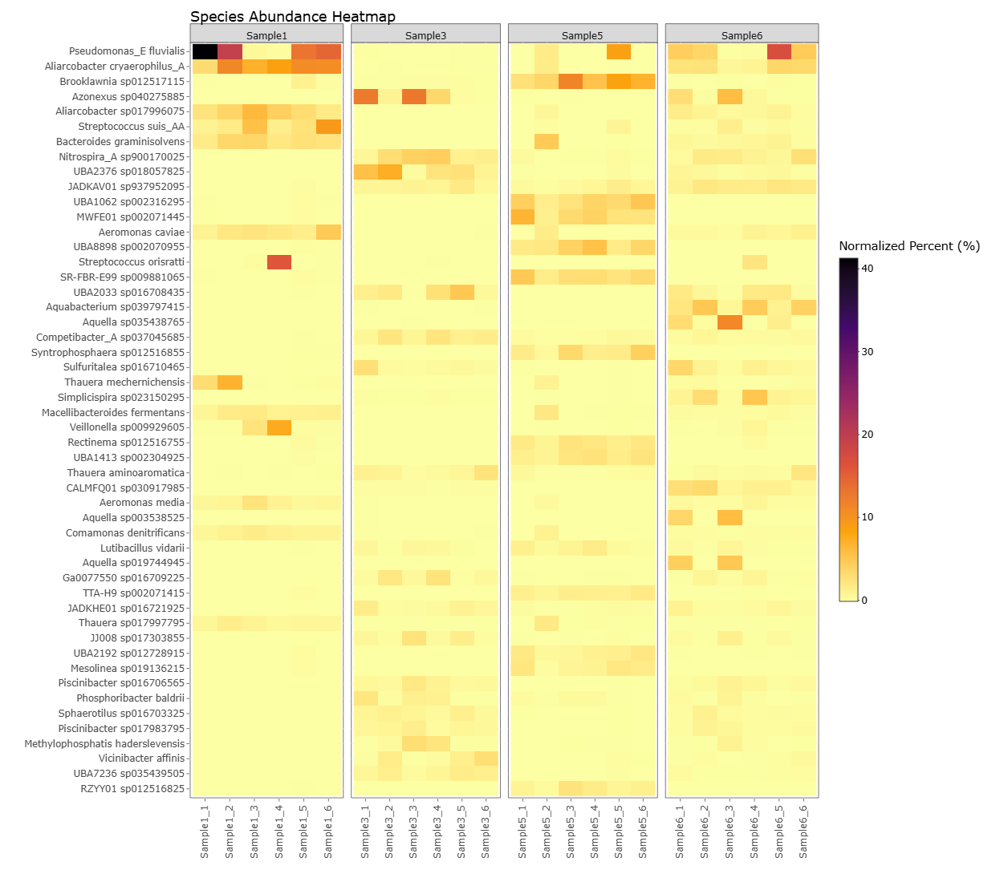

# Example Dataset

SylphScope includes an example dataset that demonstrates the complete workflow of the application, from importing **Sylph MPA** taxonomic profiles to exploring microbial community composition, beta diversity and biomarker discovery.

The example dataset contains **24 Sylph MPA profiles** organised into **four experimental groups**, each represented by **six biological replicates**.

| Group | Replicates |
|------|-----------:|
| Sample1 | 6 |
| Sample3 | 6 |
| Sample5 | 6 |
| Sample6 | 6 |

The accompanying **example_metadata.txt** file provides the required `SampleID` and `Group` columns for all comparative analyses.

---

# What can you explore?

After loading the example data, SylphScope showcases its main analysis modules.

## Interactive ordination

The **Beta Diversity** tab performs Bray–Curtis PCoA and hierarchical clustering to compare microbial community composition between sample groups.

---

## Community composition

Explore relative abundance profiles at multiple taxonomic ranks. The example below shows phylum-level composition across all samples.

---

## Biomarker discovery

SylphScope performs a LEfSe-like biomarker analysis using normalized abundance profiles to identify taxa enriched within individual groups.

---

## Species abundance heatmap

Visualize the distribution of the most abundant species across samples using an interactive heatmap.

---

# Getting started

1. Launch **SylphScope**.
2. Upload all example `.sylphmpa` files.
3. Upload `example_metadata.txt`.
4. Explore the following tabs:
   - Composition
   - Beta Diversity
   - Biomarkers
   - ANI100

No additional preprocessing is required.

---

# Notes

This dataset is provided exclusively to demonstrate the functionality of SylphScope. For your own analyses, simply replace the example `.sylphmpa` files and metadata with your own Sylph MPA outputs.
